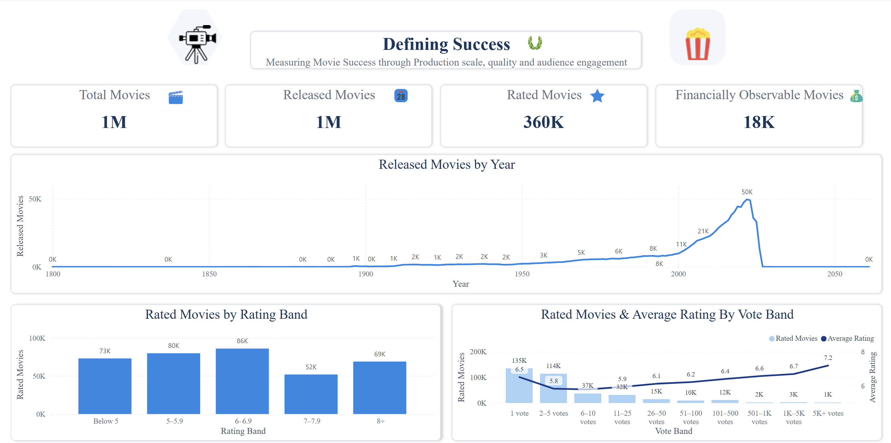
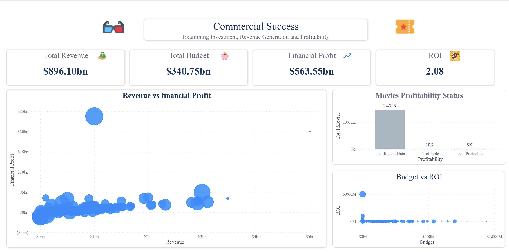

# Defining Success: A Multi-Dimensional Analysis of Movie Performance

**Analyst:** Isaac | isaactheanalyst
**Tools:** Power BI · Power Query · DAX
**Dataset:** TMDB — 1.4M+ movie records

---

## Executive Summary

This project challenges a deceptively simple question: what does it mean for a movie to be successful?

The instinctive answers — high ratings, high revenue, popularity — each capture something real but individually incomplete. A film can be critically loved and financially invisible. A blockbuster can generate billions while receiving average audience scores. True success, this analysis argues, requires measuring across all three dimensions simultaneously: audience reception, audience engagement, and financial performance.

Using a TMDB dataset of 1.4M+ records, the analysis is structured across four dashboard pages — each building toward a final synthesis in **The Verdict**, where financial and audience performance are plotted together to define what overall movie success actually looks like.

**Core finding:** A successful movie is not simply popular, highly rated, or profitable. It performs strongly across both audience and financial dimensions. These two axes are related but distinct — and neither alone is sufficient.

---

## Business Questions

This analysis was structured around the following questions:

1. How large and diverse is the global movie dataset?
2. How has movie production volume changed over time?
3. How are audience ratings distributed across the dataset?
4. Does audience engagement (vote count) correlate with rating quality?
5. How does the industry perform financially at scale?
6. What proportion of movies are financially profitable?
7. How does budget size relate to return on investment?
8. Does higher audience rating translate to higher financial profit?
9. What is the relationship between audience popularity and rating quality?
10. How should movie success be defined when combining all dimensions?

---

## Methodology

The analysis followed a structured Power BI workflow:

- **Data Connection** — TMDB dataset loaded into Power BI
- **Data Cleaning (Power Query)** — removed duplicates, dropped irrelevant columns, standardised data types, handled nulls
- **Feature Engineering (DAX)** — created calculated columns and measures including financial profit, ROI, rating bands, vote bands, profitability status, and success quadrant classifications
- **Dashboard Design** — four-page report built around a progressive narrative: scale → commercial → audience → synthesis
- **AI-Assisted DAX** — formula writing supported by AI assistance; all measures reviewed and validated against expected outputs

---

## Page 1: Defining Success — Scale and Rating Overview

### KPI Overview

[!KPI Cards](../Assets/screenshots/defining-success/KPI-cards.png)

| Metric | Value |
| --- | ---: |
| Total Movies | 1M |
| Released Movies | 1M |
| Rated Movies | 360K |
| Financially Observable Movies | 18K |

**Insight:** The dataset contains 1M+ movies, but the further you move toward financial observability the smaller the pool becomes. Of 1M released movies, only 360K have been rated, and just 18K have sufficient financial data for profit analysis. This data availability gap is itself a finding — the vast majority of film production is financially invisible, which means all financial conclusions in this report apply to a financially observable subset, not the industry as a whole.

---

### Released Movies by Year

**Insight:** Movie production remained flat for most of recorded history, then accelerated sharply from the 1980s onward, peaking at approximately 50K releases per year around 2010. The sharp drop after ~2015 toward near-zero by 2025 reflects data recency lag — recent titles have not yet been fully catalogued in the dataset rather than an actual industry decline. The long historical tail (releases dating back to 1800) shows the breadth of the dataset but also signals that pre-1950 data is sparse.

---

### Rated Movies by Rating Band

[!Rated Movies by Rating Band](../Assets/screenshots/defining-success/rated-movies-by-rating-band.png)

| Rating Band | Rated Movies |
| --- | ---: |
| Below 5 | 73K |
| 5 – 5.9 | 80K |
| 6 – 6.9 | 86K |
| 7 – 7.9 | 52K |
| 8+ | 69K |

**Insight:** Rating distribution is relatively even across bands with a moderate concentration in the 6–6.9 range (86K movies). The 7–7.9 band is the smallest, which is counterintuitive — it suggests a bimodal tendency where movies either land in the average-to-good range or polarise toward extremes. The 8+ band (69K) being larger than 7–7.9 (52K) is worth noting: there are more highly-rated movies than moderately-good ones, possibly reflecting that acclaimed films attract more votes and ratings, inflating their representation in the dataset.

---

### Rated Movies and Average Rating by Vote Band

[!Rated Movies and Average Rating by Vote Band](../Assets/screenshots/defining-success/rated-movies-and-average-rating-by-vote-band.png)

| Vote Band | Rated Movies | Avg Rating |
| --- | ---: | ---: |
| 1 vote | 135K | 6.5 |
| 2–5 votes | 114K | 5.8 |
| 6–10 votes | 37K | 5.9 |
| 11–25 votes | 32K | 6.1 |
| 26–50 votes | 15K | 6.2 |
| 51–100 votes | 10K | 6.4 |
| 101–500 votes | 12K | 6.6 |
| 501–1K votes | 2K | 6.7 |
| 1K–5K votes | 3K | 7.2 |
| 5K+ votes | 1K | 7.2 |

**Insight:** There is a clear and consistent relationship between vote volume and average rating quality. Movies with only 1–5 votes average 5.8–6.5; movies with 5K+ votes average 7.2. This is not simply because popular movies get rated higher — it reflects a survivorship effect: films that attract large audiences tend to be better films. The steep drop from 135K movies with 1 vote to 1K with 5K+ votes also confirms that the vast majority of rated movies receive minimal engagement. Only the most culturally significant titles accumulate thousands of votes.

---

## Page 2: Commercial Success — Financial Performance

### KPI Overview

[!Commercial KPI Cards](../Assets/screenshots/commercial-success/KPI-cards.png)

| Metric | Value |
| --- | ---: |
| Total Revenue | $896.10bn |
| Total Budget | $340.75bn |
| Financial Profit | $563.55bn |
| ROI | 2.08 |

**Insight:** Across the 18K financially observable movies, the industry generates $896bn in revenue on $340bn in budget — a financial profit of $563.55bn and an ROI of 2.08. These are strong aggregate numbers, but they are heavily skewed by a small number of blockbuster outliers, as the scatter plots below reveal.

---

### Revenue vs Financial Profit

[!Revenue vs Financial Profit](../Assets/screenshots/commercial-success/revenue-vs-financial-profit.png)

**Insight:** The scatter plot reveals a heavily right-skewed distribution. The vast majority of financially observable movies cluster near $0bn in both revenue and profit — most films, even those with financial data, generate modest returns. A small number of outliers — visible as large isolated bubbles in the upper portion of the chart — account for a disproportionate share of total industry profit. One title in particular sits at approximately $25bn in financial profit on ~$1bn in revenue, representing an extraordinary outlier that alone materially inflates the aggregate ROI figure. The financial success of the movie industry is concentrated in very few films.

---

### Movies Profitability Status

[!Movies Profitability Status](../Assets/screenshots/commercial-success/movies-profitability-status.png)

| Profitability Status | Movies |
| --- | ---: |
| Insufficient Data | 1,451K |
| Profitable | 10K |
| Not Profitable | 8K |

**Insight:** This is one of the most important findings in the analysis. Of 1M+ total movies, only 18K have enough financial data to assess profitability — and even within that group, 10K are profitable vs 8K that are not. The industry at the observable level is roughly 55/45 profitable vs unprofitable. The 1,451K movies with insufficient data represent the invisible majority of global film production, for whom profitability cannot be determined. Financial success, it turns out, is both rare and hard to measure.

---

### Budget vs ROI

[!Budget vs ROI](../Assets/screenshots/commercial-success/budget-vs-ROI.png)

**Insight:** The Budget vs ROI scatter shows an inverse relationship — the highest ROI values are concentrated at the lowest budget levels. One extreme outlier at near-zero budget achieves an ROI approaching 5,000M, representing a micro-budget film that generated extraordinary returns relative to its cost. As budget increases toward $500M–$1bn, ROI compresses toward 0M and below for some titles. This confirms a pattern seen across creative industries: low-budget productions occasionally generate extraordinary relative returns, while large-budget productions tend toward more moderate or negative ROI. Scale does not guarantee efficiency.

---

## Page 3: Audience Success — Engagement and Perceived Quality

### KPI Overview

[!Audience KPI Cards](../Assets/screenshots/audience-success/KPI-cards.png)

| Metric | Value |
| --- | ---: |
| Movies with 25+ Votes | 44K |
| Median Rating | 6.39 |
| Median Profit | $148 |

**Insight:** Filtering to movies with 25+ votes — a threshold that filters out single-vote noise — leaves 44K films. The median rating of 6.39 represents the genuine centre of audience perception for meaningfully-rated movies. The median profit of just $148 across this group is striking: even among films with genuine audience engagement, the typical financial return is near-zero. This sets up the central tension of the analysis — audience engagement and financial success do not automatically travel together.

---

### Audience Engagement

[!Audience Engagement](../Assets/screenshots/audience-success/audience-engagement.png)

**Insight:** The Audience Engagement scatter (Average Rating vs Popularity, bubble size = vote count) shows that popularity concentrates sharply in the 7–9 rating range. Below a rating of 6, almost no films achieve meaningful popularity scores. Above 7, a small number of films achieve extreme popularity (2,500–3,000+), while the dense cluster of well-rated films sits below 500 in popularity. This confirms that rating quality is a necessary but not sufficient condition for popularity — a film needs to be both good and culturally visible to achieve high engagement.

---

### Audience Rating vs Financial Performance

[!Audience Rating vs Financial Performance](../Assets/screenshots/audience-success/audience-rating-vs-financial-performance.png)

**Insight:** Plotting Average Rating against Financial Profit reveals a weak relationship. The majority of movies — regardless of their rating — cluster near $0bn in financial profit. High-rated films (8+) do appear in the profitable range, but so do average-rated films. The reference lines (median rating 6.39, median profit $148) confirm that most films land in the lower-left quadrant: below-median rating and near-zero profit. The upper-right quadrant — high rating, high profit — is sparsely populated, representing the genuinely exceptional films that succeed on both dimensions simultaneously.

---

## Page 4: The Verdict — Synthesising Movie Success

### KPI Overview

[!Verdict KPI Cards](../Assets/screenshots/the-verdict/KPI-cards.png)

| Metric | Value |
| --- | ---: |
| Financially Observable Movies | 18K |
| Financial Profit | $563.55bn |
| Median Rating | 6.39 |
| ROI | 17.06bn |

---

### Success Matrix

[!Success Matrix](../Assets/screenshots/the-verdict/success-matrix.png)

The Success Matrix plots Financial Profit (x-axis) against Average Rating (y-axis) with reference lines at median profit ($148) and median rating (6.39), creating four quadrants:

| Quadrant | Definition | Characteristics |
| --- | --- | --- |
| Overall Success | High Rating + High Profit | Sparse — the genuinely exceptional films |
| Audience Favorite | High Rating + Low Profit | Most common — critically loved, financially modest |
| Commercial Performer | Low Rating + High Profit | Exists but rare — profitable despite average reception |
| Lower Overall Performer | Low Rating + Low Profit | Below median on both dimensions |

**Insight:** The Success Matrix makes the central finding visual. The vast majority of films — even those with financial data — cluster in the Audience Favorite quadrant: above-average ratings, near-zero financial profit. The Overall Success quadrant (high rating + high profit) is sparsely populated, confirming that achieving both simultaneously is genuinely rare. Commercial Performers (profitable despite average ratings) exist but are few. The matrix shows that audience quality and financial success are related dimensions, but they are not the same dimension.

---

### What Defines Success?

[!What Defines Success](../Assets/screenshots/the-verdict/what-defines-success.png)

The analysis concludes with three findings:

**Audience Reception Matters:** Higher-rated movies demonstrate stronger perceived audience quality, but rating alone does not guarantee financial success.

**Financial Performance is Distinct:** Revenue and profit provide a separate dimension of success from audience reception. A film can excel on one and fail on the other.

**Success is Multidimensional:** The strongest definition of movie success combines audience reception with financial performance rather than relying on a single metric.

---

### The Verdict

> *"A successful movie is not simply popular, highly rated, or profitable. It performs strongly across both audience and financial dimensions."*

---

### Key Learnings

[!Key Learnings](../Assets/screenshots/the-verdict/key-learnings.png)

**Industry Exploration:** Diving into the movies and series sector showed how data can be used to understand performance in a creative industry — a domain where success is subjective but measurable patterns still emerge.

**Data at Scale:** Cleaning and modelling 1.4M+ rows in Power Query sharpened the approach to structuring large datasets for fast, reliable analysis. The data availability gap — 1M+ movies, only 18K financially observable — was itself an analytical finding rather than just a limitation.

**A New Perspective on Success:** The project pushed beyond a single metric and asked what "success" actually means for a film — and how to measure it. The answer required building a framework, not just running a query.

**Movie success isn't defined by one number. It's a combination of audience reception, engagement, and financial performance.**

---

## Key Findings

| # | Finding |
| --- | --- |
| 1 | Of 1M+ movies, only 18K have sufficient financial data — the financially invisible majority cannot be assessed for profitability |
| 2 | Movie production peaked at ~50K releases per year around 2010; post-2015 decline reflects data recency lag, not industry contraction |
| 3 | Average rating rises consistently with vote count — from 5.8 (2–5 votes) to 7.2 (5K+ votes), confirming a survivorship effect |
| 4 | The 6–6.9 rating band is the largest (86K movies); 7–7.9 is surprisingly the smallest (52K), suggesting ratings polarise rather than cluster in the middle |
| 5 | Aggregate industry profit is $563.55bn on $340.75bn budget — but this is driven by extreme outliers; the median film earns $148 in profit |
| 6 | Of financially observable movies, only 55% are profitable — financial success is far from guaranteed even for tracked productions |
| 7 | Budget and ROI have an inverse relationship — micro-budget films occasionally achieve extraordinary ROI; large-budget films cluster toward moderate or negative returns |
| 8 | High audience rating does not reliably predict high financial profit — most high-rated films still earn near-zero profit |
| 9 | The Success Matrix shows the Overall Success quadrant (high rating + high profit) is sparsely populated — achieving both simultaneously is genuinely rare |
| 10 | A successful movie is not simply popular, highly rated, or profitable — it must perform strongly across both audience and financial dimensions |

---

## Recommendations

### 1. Use a Multi-Metric Framework for Success Evaluation
A single KPI — rating, revenue, or ROI — is an incomplete measure of movie success. Studios, analysts, and investors should evaluate films across at least two dimensions: audience reception and financial performance. The Success Matrix provides a practical framework for this classification.

### 2. Treat Financial Data as a Subset, Not the Industry
Only 18K of 1M+ movies have observable financial data. Any financial conclusion drawn from this dataset applies to a high-visibility subset of global production. Low-budget and independent films dominate the invisible majority — their performance is systematically underrepresented.

### 3. Reconsider the Budget-to-ROI Assumption
Large budgets do not reliably produce strong ROI. The data shows micro-budget films can achieve extraordinary relative returns. Studios optimising for ROI efficiency — rather than absolute revenue — should look carefully at mid-to-low budget productions with strong audience engagement signals.

### 4. Use Vote Count as a Quality Filter
Raw ratings are noisy at low vote counts. A 25+ vote threshold meaningfully improves rating reliability. Any audience quality analysis should apply a minimum vote threshold before drawing conclusions from average ratings.

### 5. Recognise the Audience Favorite Category
The most populated quadrant in the Success Matrix is Audience Favorite: high rating, low profit. These films — well-received but financially modest — represent a large portion of quality cinema that is systematically undervalued by revenue-only metrics. A comprehensive success framework should account for this category explicitly.

---

## Conclusion

The question this project set out to answer — what makes a movie successful? — turns out to be genuinely complex. The data does not support a single answer.

Financial profit is real and measurable, but concentrated in a tiny fraction of productions and driven by outliers. Audience ratings are a meaningful signal of perceived quality, but do not reliably predict financial return. Popularity is correlated with quality but not determined by it.

The Success Matrix is the clearest output of this analysis: a practical tool for classifying films not by a single number, but by their position across two independent dimensions of performance. Films in the Overall Success quadrant — high rating, high profit — are rare precisely because they require excellence on both axes simultaneously.

The data at scale reinforces a truth that the creative industry already knows intuitively: most films do not succeed commercially, most films do not achieve lasting audience recognition, and the ones that do both are exceptional.

> *"A successful movie is not simply popular, highly rated, or profitable. It performs strongly across both audience and financial dimensions."*
