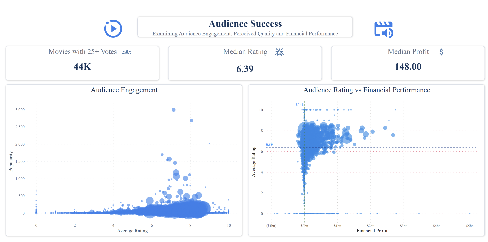
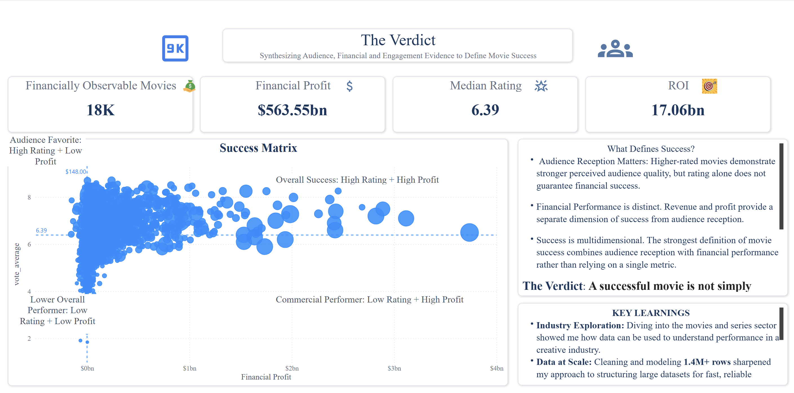

# 🎬 Defining Success: A Multi-Dimensional Analysis of Movie Performance


**Tools:** Power BI · Power Query · DAX
**Dataset:** TMDB — 1.4M+ movie records across ratings, revenue, budget, and audience engagement

A Power BI analysis of 1.4M+ movie records exploring what makes a film successful across **audience reception, engagement, and financial performance** — culminating in a **Success Matrix** that evaluates performance across all three dimensions.

---

## 📌 Project Overview

What makes a movie successful?

Rather than defining success through a single metric such as ratings, revenue, or popularity, this project develops a **multi-dimensional framework** for evaluating movie performance across audience and financial dimensions.

The analysis uses Power BI to transform 1.4M+ TMDB movie records into an interactive analytical experience covering:

- Audience reception
- Audience engagement
- Revenue and profitability
- Budget and ROI
- Production trends
- Relationships between audience and financial performance

The dashboard consists of four analytical pages, progressively building toward the final synthesis: **The Verdict**.

---

## 🎯 Business Problem

Success in the film industry is subjective — but different aspects of success can be measured.

Ratings capture audience reception.
Vote counts and popularity provide signals of engagement.
Revenue, profit, and ROI measure financial performance.

However, these measures do not always tell the same story.

This analysis therefore asks:

> **When audience reception, engagement, and financial performance are evaluated together, what does a truly successful movie look like — and how rare is it?**

---

## 📊 Dataset Overview

| Attribute | Detail |
|---|---|
| **Total Records** | 1M+ movies |
| **Rated Movies** | 360K |
| **Financially Observable** | 18K with budget + revenue available |
| **Source** | TMDB (The Movie Database) |
| **Key Metrics** | Rating, Vote Count, Revenue, Budget, Profit, ROI, Popularity |

### ⚠️ Data Availability

A major finding from the analysis is the significant gap in financial data.

Only approximately **18K movies** contain both budget and revenue information, meaning financial analysis applies to a relatively small subset of the full dataset.

This limitation is treated as an important part of the analysis rather than ignored.

---

## 🛠️ Tools & Techniques

### Power Query
- Data cleaning and transformation
- Duplicate removal
- Column selection
- Data type standardisation
- Dataset preparation

### DAX
- Calculated columns and measures
- Financial profit
- ROI
- Rating bands
- Vote bands
- Profitability classification
- Success quadrant logic

### Power BI
- KPI cards
- Scatter plots
- Bubble charts
- Bar charts
- Line charts
- Interactive filtering
- Custom Success Matrix
- Multi-page analytical storytelling

---

## 📑 Dashboard Structure

| Page | Focus | Purpose |
|---|---|---|
| **01 — Defining Success** | Dataset & Audience | Establishes dataset scale, production history, rating distribution, and vote patterns |
| **02 — Commercial Success** | Financial Performance | Examines revenue, budget, profit, ROI, and profitability |
| **03 — Audience Success** | Audience Performance | Explores engagement, ratings, popularity, and relationships with financial performance |
| **04 — The Verdict** | Success Matrix | Synthesises audience and financial performance into four success classifications |

---

## 🔎 Key Findings

### 1. Financial Data Availability Is Limited

Only approximately **18K of 1M+ movies** have both budget and revenue data available.

This means financial conclusions must be interpreted within the financially observable subset rather than applied to the entire dataset.

### 2. Movie Production Reached a Peak

Movie releases peaked at approximately **50K per year around 2010**.

The decline after 2015 appears within the dataset and should not automatically be interpreted as a decline in actual industry production.

### 3. Higher Vote Counts Are Associated With Higher Average Ratings

Average ratings increase from approximately **5.8 among movies with 2–5 votes** to **7.2 among movies with 5K+ votes**.

The analysis identifies this as evidence of a **survivorship effect** within the dataset.

### 4. Profitability Is Not the Default

Only approximately **55% of financially observable movies are profitable**.

Even when financial performance can be measured, profitability is far from guaranteed.

### 5. Budget Does Not Guarantee Strong ROI

The analysis identifies an inverse relationship between budget size and ROI.

Lower-budget films can achieve exceptionally high returns, while larger budgets can compress percentage returns.

### 6. Typical Film Profit Is Surprisingly Low

The median film profit is approximately **$148**, even within the analysed audience-engaged segment.

This highlights the large gap between exceptional financial successes and the typical movie outcome.

### 7. Rating Does Not Equal Profit

High audience ratings do not reliably translate into high financial profit.

Audience reception and commercial performance therefore need to be evaluated as related but distinct dimensions.

### 8. Overall Success Is Rare

The **high-rating + high-profit** quadrant is sparsely populated.

Achieving strong performance across both audience and financial dimensions is considerably harder than succeeding on either dimension individually.

---

## 📸 Dashboard Preview

### 01 — Defining Success


### 02 — Commercial Success


### 03 — Audience Success


### 04 — The Verdict


---

## 💡 Business Impact

The analysis demonstrates why movie performance should not be evaluated through a single KPI.

A film can be:

- Highly rated but commercially weak
- Financially successful without exceptional audience ratings
- Strong in audience engagement but limited financially
- Strong across both audience and financial dimensions

The **Success Matrix** provides a framework for distinguishing these outcomes.

### Key Business Takeaways

- A multi-dimensional framework provides more context than a single performance KPI
- Financial data availability must be considered when evaluating movie performance
- Budget size alone does not determine financial efficiency
- Audience reception and financial performance are distinct dimensions of success
- Films performing strongly across both dimensions represent a relatively rare outcome

> *"A successful movie is not simply popular, highly rated, or profitable. It performs strongly across both audience and financial dimensions."*

---

## 🧩 Success Matrix

The final dashboard synthesises the analysis into four performance classifications:

| Classification | Description |
|---|---|
| 🏆 **Overall Success** | Strong audience reception and strong financial performance |
| ❤️ **Audience Favorite** | Strong audience reception but weaker financial performance |
| 💰 **Commercial Performer** | Strong financial performance but weaker audience reception |
| 📉 **Lower Overall Performer** | Weaker performance across both dimensions |

This framework is the central output of the analysis and provides a more nuanced definition of movie success.

---

## 📖 Detailed Analysis Report

For the complete methodology, page-by-page dashboard walkthrough, visual analysis, detailed insights, and strategic recommendations:

📖 **[View Full Analysis Report](Analysis-Report/Defining_Success_Analysis_Report.md)**

📄 [Download Full PDF Report](https://drive.google.com/file/d/1VD22lZf7qWX7-dnNxoRY1ZB2Ejow0FZg/view?usp=sharing)

---

## 📁 Repository Structure

```text
defining-success-movie-analysis/
│
├── README.md
│
├── Assets/
│   ├── cover/
│   │   └── cover.svg
│   │
│   └── screenshots/
│       ├── defining-success/
│       ├── commercial-success/
│       ├── audience-success/
│       └── the-verdict/
│
└── Analysis-Report/
    └── Defining_Success_Analysis_Report.md
```

---

## 👤 Author

**Isaac Olatunji**
Business Intelligence Analyst focused on transforming data into actionable business insights through SQL, Power BI, Excel, and data storytelling.

🔗 GitHub: [isaactheanalyst]([(https://github.com/isaac-olatunji)])
🔗 LinkedIn: [olatunjiisaac](https://www.linkedin.com/in/olatunjiisaac)
