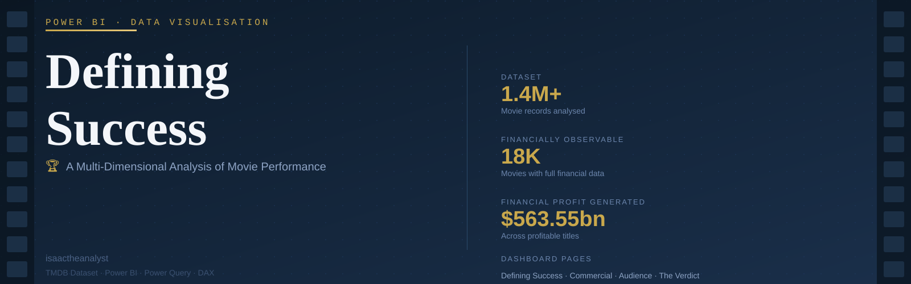
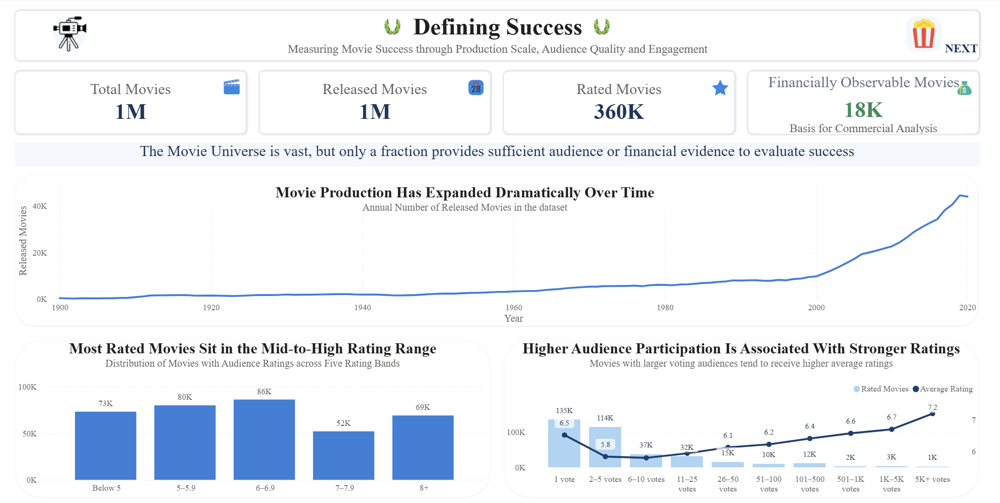
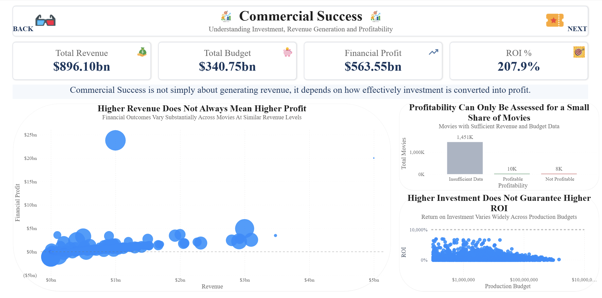
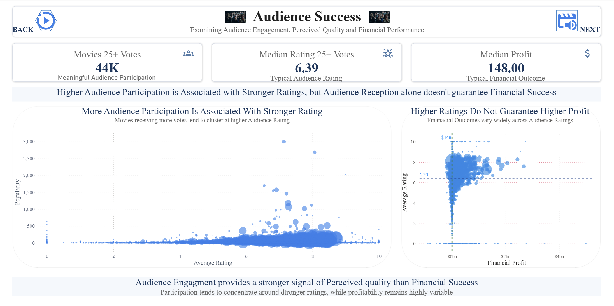
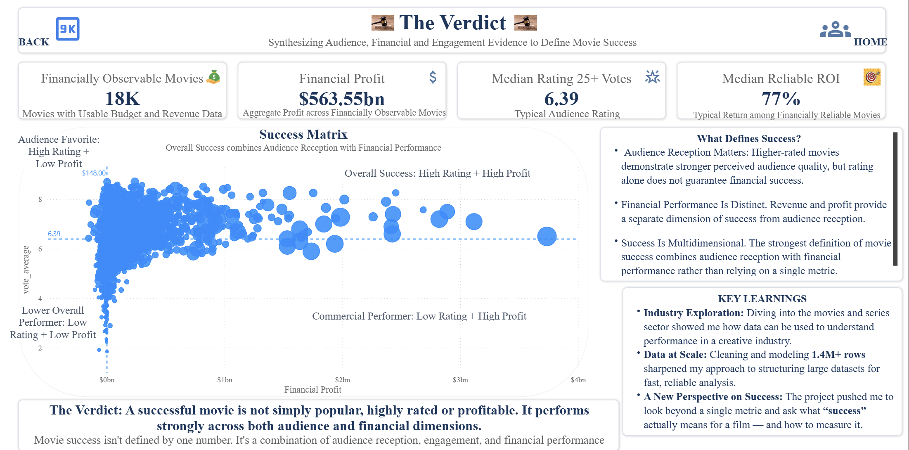

# 🎬 Defining Success: A Multi-Dimensional Analysis of Movie Performance



**Tools:** Power BI · Power Query · DAX
**Dataset:** TMDB — 1.4M+ movie records across ratings, revenue, budget, and audience engagement
**Competition:** Power BI DataViz World Championships — Final Round

A Power BI analysis of 1.4M+ movie records exploring what makes a film successful across **audience reception, engagement, and financial performance** — culminating in a **Success Matrix** that evaluates performance across all three dimensions.

---

## 📌 Project Overview

How do filmmakers, directors, writers, studios, and investors actually know whether a movie has been successful?

Revenue numbers take months to materialise. Audience ratings reflect a fraction of viewers. ROI can be extraordinary for a micro-budget film and near-zero for a blockbuster. And none of these measures tells the complete story on its own.

Rather than defining success through a single metric, this project builds a **multi-dimensional analytical framework** for evaluating movie performance across audience and financial dimensions.

The dashboard is structured as a four-page **data-storytelling narrative** — each page answers one central question and builds toward the final synthesis in The Verdict.

```
Movie Landscape → Financial Performance → Audience Success → The Verdict
```

---

## 🎯 Business Problem

Movie success is routinely reduced to a single metric — box office revenue, audience rating, or ROI. But none of these alone tells the complete story:

- A film can generate substantial revenue but produce little profit
- A highly rated film can perform poorly financially
- A micro-budget film can achieve extraordinary ROI while remaining unknown
- A commercially successful film can carry only average audience ratings

This analysis asks:

> **Can movie success be better understood by combining audience reception, engagement, and financial performance into a single framework?**

---

## 📊 Dataset Overview

| Attribute | Detail |
|---|---|
| Total Records | 1.4M+ movie records |
| Rated Movies | 360K |
| Financially Observable | 18K (budget + revenue available) |
| Financially Reliable | ~10K (used for credible ROI analysis) |
| 25+ Vote Subset | 44K (used for meaningful audience analysis) |
| Source | TMDB (The Movie Database) |
| Key Metrics | Rating, Vote Count, Popularity, Revenue, Budget, Profit, ROI |

### ⚠️ Data Availability

A major analytical finding is the significant gap in financial data. Only 18K of 1M+ movies contain usable financial information — meaning financial conclusions apply to a small, high-visibility subset, not the global film industry.

---

## 🛠️ Tools & Techniques

### Power Query
- Data cleaning and transformation
- Duplicate removal, column selection, type standardisation
- Invalid date handling (original range: 1800–2099, constrained to 1900–2020)
- Separating financially usable from unusable records
- Creating analytical population flags

### DAX
- Financial profit, ROI, reliable ROI
- Rating bands and vote bands
- Profitability and success quadrant classification
- Median-based KPIs (preferred over averages for skewed distributions)
- Reference values for scatter plot benchmarks

### Power BI
- KPI cards, scatter plots, bubble charts, bar and line charts
- Logarithmic scaling for financial distribution visuals
- Reference lines for analytical benchmarks
- Interactive navigation (BACK / NEXT / HOME)
- Insight banners — each page states its conclusion in plain language
- Four-page editorial data-storytelling structure

---

## 📑 Dashboard Structure

| Page | Title | Central Question |
|---|---|---|
| 01 | Defining Success | What does the movie landscape look like, and how should success be measured? |
| 02 | Commercial Success | Does greater investment translate into greater financial returns? |
| 03 | Audience Success | Does audience participation translate into stronger ratings and financial outcomes? |
| 04 | The Verdict | What ultimately defines a successful movie? |

---

## 🔎 Key Findings

| Finding | Detail |
|---|---|
| Data Availability Gap | Only 18K of 1M+ movies have financial data — the majority of global production is financially invisible |
| Production Growth | Movie releases expanded dramatically from 1900, accelerating sharply from 2000 to 40K+ per year by 2020 |
| Vote-Rating Link | Average rating rises from 5.8 (2–5 votes) to 7.2 (5K+ votes) — a survivorship effect, not causation |
| Rating Polarisation | The 7–7.9 band (52K) is smaller than 8+ (69K) — ratings polarise rather than cluster in the middle |
| Median Film Profit | $148 — despite $563.55bn aggregate profit, the typical film earns near-zero |
| Profitability Rate | ~55% of financially observable movies are profitable — not the default outcome |
| Budget vs ROI | Inverse relationship — micro-budget films achieve the highest ROI; large budgets compress toward 0% |
| Median Reliable ROI | 77% — far more representative than aggregate ROI; P99 reaches 6,949% showing extreme right-skew |
| Rating ≠ Profit | High ratings do not reliably predict high financial profit |
| Overall Success is Rare | High rating + high profit quadrant is sparsely populated — achieving both simultaneously is exceptional |

---

## 📸 Dashboard Preview

### 01 — Defining Success


### 02 — Commercial Success


### 03 — Audience Success


### 04 — The Verdict


---

## 🧩 Success Matrix

The final page synthesises the analysis into four performance classifications:

| Classification | Description |
|---|---|
| 🏆 **Overall Success** | High audience rating + high financial profit |
| ❤️ **Audience Favourite** | High rating + low financial profit — the most common quadrant |
| 💰 **Commercial Performer** | Lower rating + high financial profit |
| 📉 **Lower Overall Performer** | Below median on both dimensions |

The Audience Favourite quadrant is the most densely populated — confirming that audience quality and financial success are related but distinct dimensions that rarely align at the highest level simultaneously.

---

## 💡 Business Impact

This analysis demonstrates why movie performance should not be evaluated through a single KPI.

Key takeaways:
- A multi-metric framework (audience + financial) reveals what single metrics conceal
- Profit and ROI are different measures — both are needed; neither alone is sufficient
- Financial data covers only a small fraction of global production — conclusions must be scoped accordingly
- The median (77% reliable ROI, $148 median profit) is far more representative of typical movie performance than aggregate figures
- The Success Matrix provides a practical classification tool for studios, analysts, and investors

> *"A successful movie is not simply popular, highly rated, or profitable. It performs strongly across both audience and financial dimensions."*

---

## 📁 Repository Structure

```text
defining-success-movie-analysis/
│
├── README.md
│
├── Assets/
│   ├── cover/
│   │   └── cover.svg
│   └── screenshots/
│       ├── defining-success/
│       ├── commercial-success/
│       ├── audience-success/
│       └── the-verdict/
│
└── Analysis-Report/
    └── Defining_Success_Analysis_Report.md
```

---

## 📖 Detailed Analysis Report

For complete methodology, analytical decisions, page-by-page insights, ROI distribution analysis, and the full framework:

📖 **[View Full Analysis Report](Analysis-Report/Defining_Success_Analysis_Report.md)**

---

## 🏅 Competition

**Power BI DataViz World Championships — Final Round**

This project was developed as a competition submission exploring:

> *What makes a successful movie?*

The dashboard combines large-scale data preparation, analytical modelling, and data storytelling to answer the question from multiple perspectives.

---

## 👤 Author

**Isaac Olatunji**
Business Intelligence Analyst focused on transforming data into actionable business insights through SQL, Power BI, Excel, and data storytelling.

🔗 GitHub: [isaac-olatunji]([(https://github.com/isaac-olatunji)])
🔗 LinkedIn: [olatunjiisaac](https://www.linkedin.com/in/olatunjiisaac)
